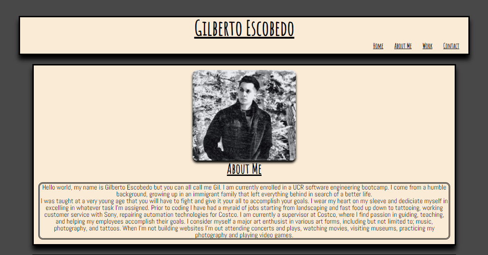

# Gilberto-Escobedo-Portfolio
Github Deployed Link: [https://n7-gil.github.io/Gilberto-Escobedo-Portfolio/]

The purpose of this assignment was to create a functional website that served as our portfolio to display other works we have done in our class. We needed to include; our name, an image of ourselves and a working navigation that redirects to the section once clicked on. Most of the challenges that were presented to me was having the website cooperate when resizing from desktop to mobile and other screen sizes. Overall I'm satisified with the outcome of one of my very first websites built from scratch. I'm excited to compare my future works with my beginner ones!

